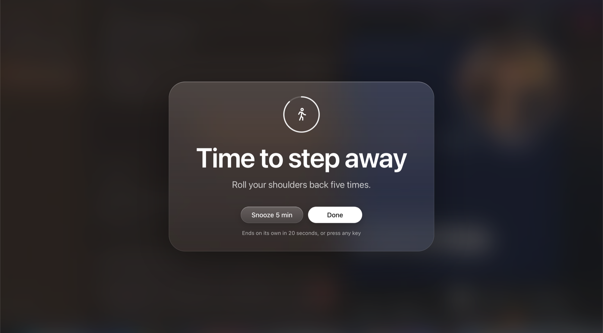
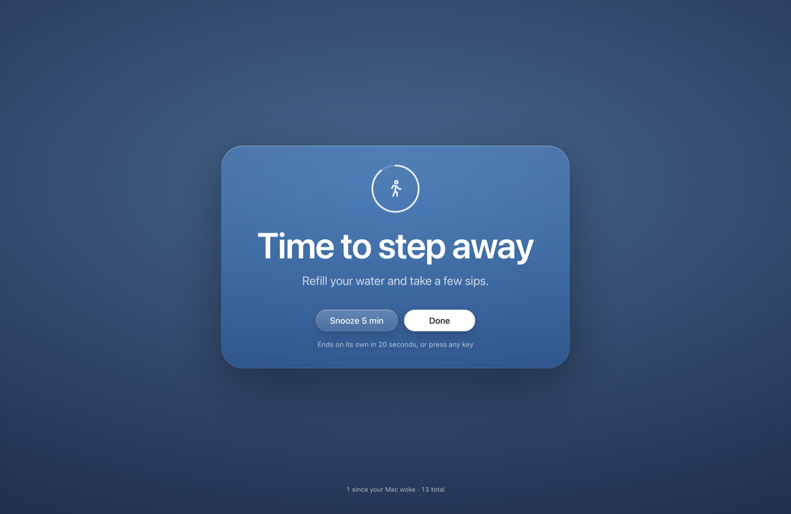
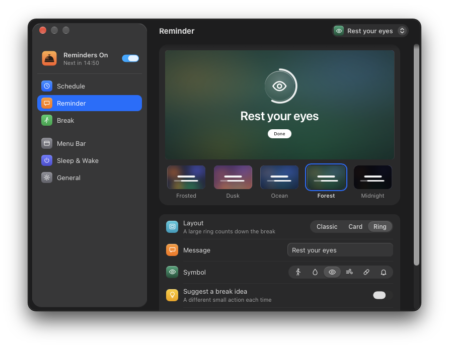
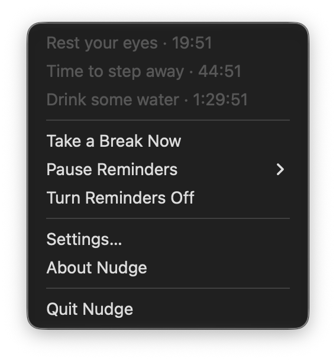
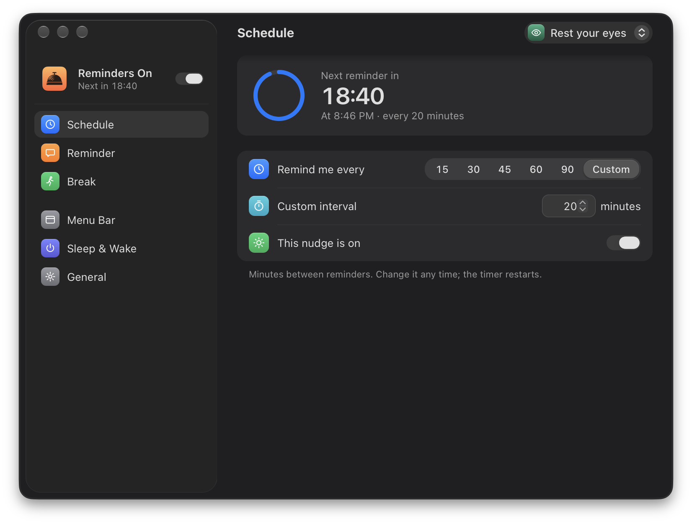

# nudge

`nudge` is a free menu bar app that displays firm but gentle reminders. It
runs on macOS, Windows and Linux, sits in your menu bar or system tray, and on
a timer covers every screen with a fullscreen reminder until you dismiss it
with a click or any key.

It is useful for the Pomodoro Technique and for remembering to get up from your
desk from time to time.

<p align="center">
  
  
</p>

<p align="center">
  
</p>

<p align="center">
  
  
</p>

## Getting started

1. Build and install it (see [Building from source](#building-from-source)).
   On a Mac, `npm run install:app` puts `Nudge.app` in `/Applications` and
   opens it.
2. Click the Nudge icon in the menu bar. The menu shows how long until the
   next reminder and has Take a Break Now, Pause Reminders and Settings.
3. In Settings, pick how often to be reminded on the Schedule page and how the
   reminder looks on the Reminder page. Changes apply right away.
4. On a Mac, allow Input Monitoring if you want any key to close the reminder
   (see [Permissions](#permissions-macos)).

## Features

- Menu bar / system tray icon: click it for the menu with a live countdown,
  Take a Break Now, Pause Reminders (30 minutes, 1 hour, 2 hours), on/off,
  Settings and About
- Full screen reminder over every connected display that stays visible over
  fullscreen apps and workspaces. On macOS the Frosted style shows a blur of
  what is behind it
- Click, press Done, or press any key to dismiss; optional Snooze button
- Interval presets of 15/30/45/60/90 minutes plus a custom value, applied live
- Up to 8 nudges, each with its own message, interval, symbol, look and
  break settings. The pop-up at the top of Settings picks the one to edit and
  adds or deletes nudges. The menu shows a countdown line for each, and nudges
  that come due within a minute of each other share one reminder, with the
  others listed under "Also now"
- Settings persist between runs and follow light and dark mode. They are
  saved to `config.json` in the `nudge` folder of your user config
  directory (`~/Library/Application Support/nudge/` on macOS)

### Make it yours

Options chosen to keep reminders noticeable, kind and low friction, which
matters most if you have ADHD or tend to hyperfocus:

- A symbol for each nudge: walking figure, water drop, eye, breath, pill or
  bell
- Your own message, plus an optional break idea that changes every time
  (refill your water, jot down where you left off) so the reminder does not
  fade into the background
- Five reminder styles (Frosted, Dusk, Ocean, Forest, Midnight) and three text
  sizes, with a Preview button
- Three reminder layouts: Classic (text on the backdrop), Card (a glass panel)
  and Ring (a large ring around the icon that counts down the break when a
  break length is set)
- Break length: the reminder can close by itself after 20 seconds to 10
  minutes, with a ring that shows the time left
- Snooze length (or no snooze button at all)
- Sound: Chime, macOS system sounds, or none
- Time left in the menu bar: never, only in the last 5 minutes as a heads-up,
  or always (macOS and Linux)
- Show or hide the reminder counter
- After waking from sleep: re-enable reminders, restart the timer
- Open at login

## Building from source

Requires Node, npm and the Rust toolchain.

```
npm install
npm run tauri dev     # run in development
npm run build         # produce an installer/binary in src-tauri/target
npm run install:app   # build a release bundle and install/relaunch /Applications/Nudge.app (macOS)
```

`install:app` signs the app with the first "Developer ID Application"
certificate in your keychain (override with `APPLE_SIGNING_IDENTITY`). A
stable signature lets macOS remember the Input Monitoring permission across
updates. Without a certificate the app is ad-hoc signed.

## Permissions (macOS)

To close the reminder with any key while another app is frontmost, Nudge
needs Input Monitoring (System Settings > Privacy & Security > Input
Monitoring). Without it, the reminder still closes with a click, the Done
button, or a key typed while the reminder has focus. Open at login installs a
LaunchAgent in `~/Library/LaunchAgents`.

## Platform notes

- macOS: the reminder panel behaves like a native HUD, joining all workspaces
  and floating above fullscreen apps
- Windows and Linux: the reminder is a fullscreen always-on-top window
- Wake-from-sleep detection works on macOS and Linux

## Credits

`nudge` is inspired by and modeled on
[remindful](https://github.com/brettferdosi/remindful) by
[Brett Gutstein](https://brett.gutste.in), a macOS app that did it first.
Thank you for the idea and the design. `remindful` is a Swift app for macOS;
`nudge` was written from scratch in Rust with Tauri so it also runs on Windows
and Linux. The product behavior, the tray toggle, the countdown menu and the
full-screen reminder pattern all come from `remindful`.

## License

MIT. The upstream notice for `remindful`, whose design inspired this app, is
preserved in `LICENSE`.
